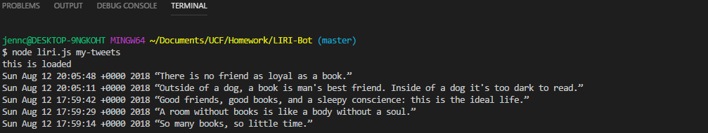
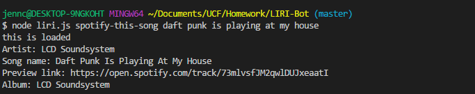
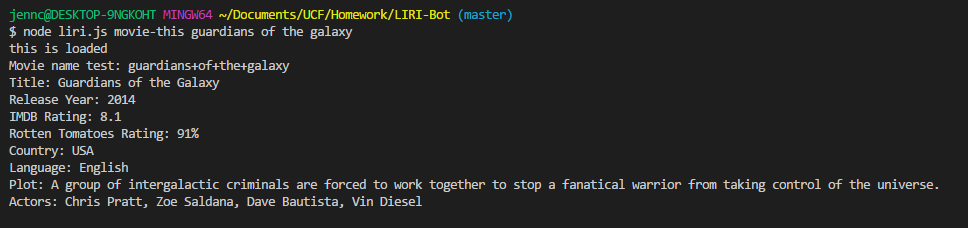
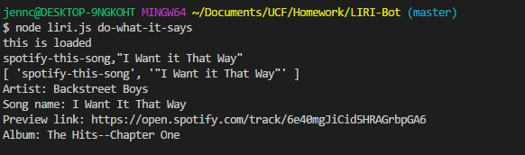

# LIRI-Bot
A command line node app that takes in parameters and gives you back data.

# What Each Command Does

<h2> node liri.js my-tweets </h2>

This will show my last 20 tweets and when they were created at in the terminal/bash window.

<h2> node liri.js spotify-this-song 'song name here' </h2>

This will show the following information about the song in the terminal/bash window

    Artist(s)

    The song's name

    A preview link of the song from Spotify

    The album that the song is from

If no song is provided then your program will default to "The Sign" by Ace of Base.

<h2>node liri.js movie-this 'movie name here' </h2>

This will output the following information to the terminal/bash window:

  * Title of the movie.
  * Year the movie came out.
  * IMDB Rating of the movie.
  * Rotten Tomatoes Rating of the movie.
  * Country where the movie was produced.
  * Language of the movie.
  * Plot of the movie.
  * Actors in the movie.

If the user doesn't type a movie in, the program will output data for the movie 'Mr. Nobody.'

<h2>node liri.js do-what-it-says </h2>

Using the fs Node package, LIRI will take the text inside of random.txt and then use it to call one of LIRI's commands.

# Screenshots
<h2>my-tweets</h2>

<h2>spotify-this-song</h2>

<h2>movie-this</h2>

<h2>do-what-it-says</h2>

